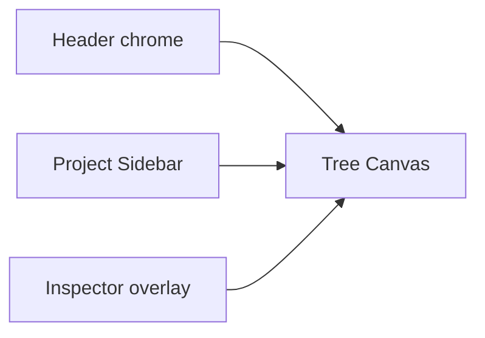
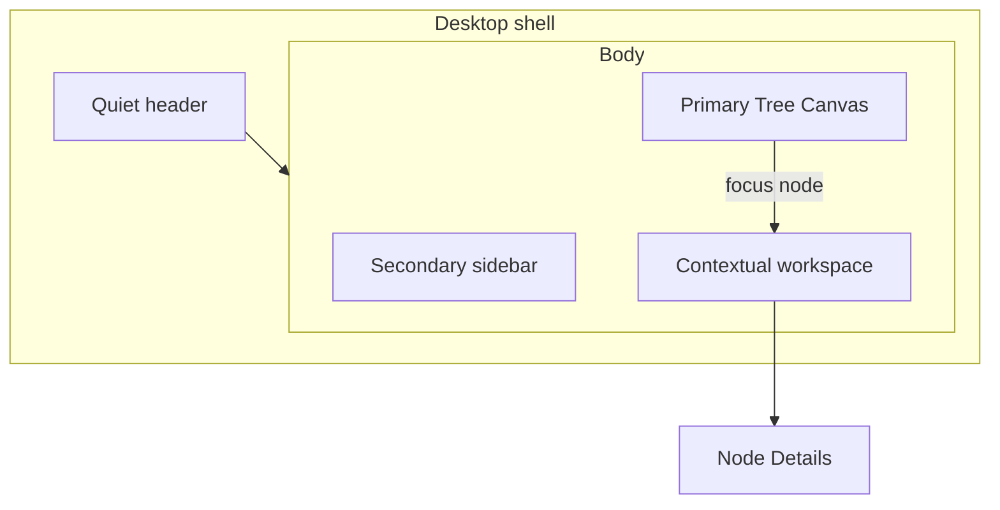

# Learning Tree UI Reference Study

Status: Design Review accepted.

This document is the formal UI / Interaction reference for Project Learning Tree. It is not an implementation milestone.

Approved direction: **Direction C — Node-focused contextual workspace**, with canvas-first visual discipline.

Approved product decisions (do not reopen):

1. Inspector becomes a collapsible layout column.
2. Focusing a node auto-opens Details.
3. Focusing a node does not auto-open Chat.
4. Workspace-level Chat is allowed in M3.
5. Closed nodes remain visible by default.
6. Fit (P1): Active Stack if non-empty, otherwise fit all.
7. Blocking uses warning, not danger red.
8. Selected / Focus uses blue.
9. Active / Active Stack uses learning teal.
10. Tree Canvas is always Primary.
11. Next implementation milestone is M2.6, then M3.

Approved planning revisions after Design Review:

1. M2.6 does **not** create `NodeChat`, a `chat/` folder, or any Chat stub.
2. M2.6 does **not** add `chatOpen`, `chatPinnedNodeId`, or `contextualMode`. Keep `inspectorOpen` / `inspectorWidth` with no preference migration.
3. Custom zoom / Fit Active Stack / Fit All are **P1**. M2.6 P0 does not depend on them. Defer P1 if it expands implementation complexity.

This study does not change Domain Engine, Workspace semantic model, persistence boundary, multi-project architecture, localization architecture, or `workspace.shell.colorScheme` as the theme source of truth.

---

## 1. Executive Summary

Learning Tree already has the right **product skeleton**: multi-project shell, Tree Canvas as the per-project workspace, overlay Inspector, four-channel node state (lifecycle / Active Stack / Current Focus / derived Blocked), tokenized light/dark, localization, and a clean persistence boundary.

It does **not** yet have a mature **visual and interaction hierarchy**. Chrome, canvas, and Inspector compete at similar contrast. Nodes still read as React Flow cards. Inspector is a catch-all. Chat does not exist, so M3 has no spatial home — but M2.6 must prepare that home **without building Chat**.

**Recommended direction: Direction C — Node-focused contextual workspace**, visually treated as canvas-first (from Direction A).

- **Primary:** Tree Canvas
- **Secondary:** receded Project Sidebar and quiet header
- **Contextual:** right workspace. M2.6 contains **Node Details only**. Chat is an M3 mode of the same workspace, not a second panel and not a stub.
- **Hidden by default:** Frontier, MiniMap, command palette, archived pane
- **User-opened:** Chat (M3), Frontier (later), Details if closed, Archived

Do not copy Linear's issue tracker, Heptabase's freeform whiteboard, Capacities' "chat as object type", or Tana's outline-as-only-UI.

Protect: Domain Engine, Workspace semantic model, persistence split, multi-project architecture, locale, theme source of truth (`workspace.shell.colorScheme`).

---

## 2. Current UI Diagnosis

Sources: [`src/ui/App.tsx`](../../src/ui/App.tsx), [`src/ui/styles.css`](../../src/ui/styles.css), [`src/ui/tree/LearningNode.tsx`](../../src/ui/tree/LearningNode.tsx), [`src/ui/tree/TreeCanvas.tsx`](../../src/ui/tree/TreeCanvas.tsx), [`src/ui/inspector/NodeInspector.tsx`](../../src/ui/inspector/NodeInspector.tsx), visual snapshots, [`docs/product/interaction-spec.md`](../product/interaction-spec.md).

### What exists

- Header: app title, project name, Active Stack breadcrumb, settings (locale + theme)
- Left: collapsible/resizable `ProjectSidebar` (active + archived panes)
- Center: `tree-pane` + XYFlow (`Background`, pan, zoom 0.4–1.5, no Controls, no MiniMap)
- Right: Inspector as **absolute overlay** (shadow, 320–420px), not a layout column
- Empty states for no-workspace and no-core-question
- Node: question, lifecycle text, optional blocked count, stack rail, focus outline
- Inspector: question/goal/lifecycle/blocked, lifecycle actions, child authoring, collapsible DoD/evidence/summary
- Tokens already exist: canvas/surface/elevated, accent teal, selected blue, parked/closed tints, spacing 4–24, radius 6/10/14

### What the frozen spec wants but UI does not have

Interaction spec regions: Learning Tree, **Focus Panel (conversation)**, Node Inspector, **Learning Frontier**. Only Tree + Inspector are built. Conversation and Frontier are domain-only.

### Diagnosis (not cosmetic)

1. **Chrome does not recede.** Header, sidebar, and canvas share `--color-bg-surface` / nearby neutrals. Borders are everywhere. Selected project is a bordered card. The tree is not the visual center.
2. **Canvas still feels like an XYFlow demo.** Default dotted `Background`, no product chrome of our own, default node boxes, equal-loud lifecycle labels, 260×92 cards with 40/72 gaps.
3. **Selected vs Active is correctly split in tokens, poorly staged.** Focus = blue outline + shadow; Active = green fill + left rail. The *idea* is right (M2.4). Execution is loud: outline-offset 3px plus fill plus rail plus lifecycle word.
4. **Inspector is already the dump panel M3 must not inherit.** It mixes identity, lifecycle verbs, child authoring, close-gate, DoD, evidence, summary in one scroll. Overlay shadow covers the tree it is supposed to explain.
5. **Node is only a box.** Domain node is question + goal + DoD + evidence + summary + children + blocking + `conversationThreadId`. Canvas shows question + lifecycle word + blocked count. Hover is shadow only.
6. **Buttons are over-bordered.** Almost every control is `1px border + radius-sm`. Primary actions and ghost chrome look related.
7. **Empty states are the strongest UI today.** Quiet canvas, one primary CTA, muted description. Populated workspace is noisier than empty workspace — inverted product quality.
8. **Information density is uniformly medium.** Sidebar rows are large cards; nodes are large cards; inspector fields are stacked `<dl>` with 11px labels.



All four currently compete. The study's job is to make canvas win.

---

## 3. Product Reference Matrix

For each product: what to take, what to refuse.

- **Linear — chrome discipline.** Receding sidebar/header, density, hover-before-chrome, selected as surface not card-border, inspector as meta not editor-of-everything. Do not copy issue hierarchy, statuses, cycles, or indigo brand.
- **Heptabase — canvas as thinking space.** Zoom-to-selection, fold unused objects, contextual right apps (Chat/Info), card vs board contrast. Do not copy freeform placement as knowledge model, "whiteboards do not own cards", infinite doodling, or card-as-document.
- **Capacities — object stays, side work opens.** Side panel for AI/backlinks/search without leaving the current object; explicit AI context; propose-then-approve edits. Do not copy chat-as-first-class-object-type, `@` graph mentions as the IA, or object-type dashboards.
- **Tana — node-first information architecture.** Zoom, breadcrumb, expand/collapse, same node / multiple views. Do not copy outline-only UI, supertags, or "everything is a bullet".

Learning Tree is a **learning-state tree**, not an issue tracker, not a PKM whiteboard, not a networked notebook, not an outliner.

---

## 4. Linear Analysis

**Reference.** Linear app shell: inverted-L (sidebar + header), content fills the rest. 2024 chrome refresh reduced visual noise in sidebar, tabs, headers, panels so the list/board becomes the center. Density comes from alignment and restraint. Hover is a 4–8% surface shift; selected is a slightly stronger fill, not a 1px card. Secondary text is muted; section labels are 11–12px. Contextual actions appear on hover. Inspector/detail is properties + activity, not a second application.

**What works.** Peripheral UI recedes. Primary work owns contrast. Selected/hover/active are a scale, not three different decoration systems. High information, low ornament.

**Why it works.** Product work happens in the center. Chrome is navigation, not content.

**Learning Tree adaptation.**

- Project Sidebar: same background family as header, **no selected card border**; selected = accent-subtle fill + primary text only.
- Header: thinner, project title primary, app name muted or mark-only, stack breadcrumb as text not legend chrome.
- Hover on nodes/rows: background/elevation before new borders.
- Details actions: one primary verb, rest ghost. Close-unmet as a quiet list, not a second card.
- Density: sidebar rows closer to 32–36px than 44px+card.

**What NOT to copy.** Issue graph, workflow states as colored pills everywhere, command-bar as the product, indigo accent replacing learning teal, Inter weight 510 as a CJK-hostile signature.

---

## 5. Heptabase Analysis

**Reference.** Infinite whiteboard; card is the unit; board is a spatial thinking surface. Cards can fold; double-click / side panel reads the full card; Shift+1 fit all, Shift+2 fit selection; right sidebar swaps Chat / Library / Info per tab. Whiteboards do **not** own cards. Chat can be scoped to the current tab.

**What works.** Canvas is obviously the work. Unused cards recede. Focus is zoom + selection border, not filling the card with metadata. Right side is **contextual apps**, not one eternal properties dump.

**Why it works.** Spatial memory + progressive detail. You see the landscape, then enter a card.

**Learning Tree adaptation.**

- Tree Canvas must feel like the landscape of learning, not a diagram widget.
- Quiet background; no demo grid.
- Parked/closed/off-stack nodes fold visually (opacity, smaller type, quieter edges).
- Details (M2.6) and later Chat (M3) are modes of the right workspace, like Heptabase right-sidebar apps — but Chat is not built in M2.6.
- Fit-to-stack / fit-all are the Heptabase Shift+1/2 analog. They are **P1**, not a P0 dependency.

**What NOT to copy.** Freeform 2D as the knowledge model. Learning Tree parent/child is domain truth; drag may move `nodePositions` only. Do not let users draw arbitrary links. Do not treat nodes as documents you write on the canvas. Do not add a card library parallel to the tree. Do not put MiniMap on by default.

**Tree-suitable vs not.**

- Suitable: canvas primacy, fold unused, zoom to focus, contextual right apps, selection ≠ edit.
- Unsuitable: spatial uniqueness as meaning, mixed object types on one board, mind-map mode, nested whiteboards as IA.

---

## 6. Capacities Analysis

**Reference.** Object is the unit. Main page stays. Side panel opens extra objects, backlinks, search, AI. AI chat: context via `@` / current object; chats auto-save as objects; assistant **proposes** creates/updates for approval.

**What works.** You never lose the current object. AI is beside work, not a separate product. Context is visible. Mutations are gated.

**Why it works.** Knowledge work is "this thing + related things". Leaving the page to chat would break continuity — the same problem Learning Tree exists to solve vs linear chat.

**Learning Tree adaptation.**

When a node is selected:

- Tree stays (canvas remains primary).
- Contextual workspace opens on the right as **Details** in M2.6.
- In M3, Chat header: **正在讨论：{Node Question}** / `Discussing: {question}`.
- Context is the node (plus project/pass), not a user-built `@` graph.
- AI-discovered questions appear as **proposals** (Accept blocking child / Send to Frontier / Discard). Domain does not mutate until the user accepts.

**Answers (M3 spatial model; not M2.6 work).**

- Where is Chat? **Contextual right workspace, Chat mode** — not a floating bubble on the node, not a fourth column, not a replacement for the canvas.
- Detail vs Chat: **one workspace, two modes** (plus later Frontier). Not two independent panels. Not one scrolled dump. M2.6 ships Details only; do not add a Chat placeholder.
- How the tree is not lost: canvas never unmounts; column can close; M3 pin keeps chat context while canvas selection may move.
- How the user knows which node AI is on: persistent context chip in the chat header (M3).

**What NOT to copy.** Chat as a separate object type with backlinks, tags, collections. Explore-home for chats. Semantic search of a whole PKM. Multiple stacked side-panel objects.

---

## 7. Tana Analysis

**Reference (IA, not visual).** Everything is a node. Zoom into a node and it becomes the page; outline underneath is content. Breadcrumbs show part-of. Expand/collapse controls density. Same node can appear as outline row, zoomed page, or side panel.

**What works.** One object, many views. Zoom is a **navigation verb**, not only a canvas scale. Breadcrumbs answer "where am I in the tree?" Collapse is how large trees stay readable.

**Why it works.** Hierarchical knowledge is too big to show fully. The node is the address.

**Learning Tree adaptation.**

A Learning Node **is** simultaneously:

- Tree Node (canvas glyph)
- Knowledge Object (question, goal, DoD, evidence, summary)
- Conversation Context (`conversationThreadId`)
- Question (the primary label)
- Evidence Container
- Summary Container
- Navigation Target (focus, activate, return to parent)

It must **not** display all of those jobs on the canvas box. Canvas = address + status. Contextual workspace = the zoomed object. Chat (M3) = the conversation view of the same object.

**Zoom for Learning Tree** is not Tana's replace-the-page. It is:

1. Canvas: pan/zoom the tree (spatial). Existing XYFlow wheel zoom remains in P0.
2. Focus: open contextual workspace (object zoom). This is M2.6.
3. Optional later: "isolate branch" (hide off-path nodes).

Header breadcrumb should be **Active Stack**, not Current Focus. Current Focus is indicated on the node (and, in M3, the chat chip).

**What NOT to copy.** Outline as the only UI. Indent/outdent as structure editing (parent/child is domain). Supertags. Daily notes. Multi-panel node editing as default.

---

## 8. Learning Tree Design Principles

1. **Canvas is the product.** Sidebar, header, and panels exist to serve the tree.
2. **Conversation belongs to a node.** Chat never owns the tree. Chat is not built until M3.
3. **Focus ≠ Active.** Viewing must not look like activating. Keep blue selected vs teal active.
4. **Progressive disclosure.** Canvas is quiet; hover adds cues; selection opens detail.
5. **AI proposes; UI confirms; domain executes.** Suggestion chips, never silent tree edits. (M3)
6. **Recede chrome.** Prefer background differentiation over borders. Borders only for true edges (pane seams, inputs, menus).
7. **One primary verb per surface.** Details: Activate/Park/Close as staged, not five equal buttons.
8. **Closed and parked are history, not noise.** Lower contrast; do not delete from the tree.
9. **Blocking is a relationship, not a badge theme.** Show on the edge and as a small warning mark, not a second card.
10. **Density is a scale, not a style.** Default compact-medium. Do not invent a "mind map" look.
11. **Same tokens, two themes.** No separate "dark redesign".
12. **Do not add chrome for future milestones.** No MiniMap, graph view, plugin rail, Chat stub, or Chat preference fields in M2.6.

---

## 9. Information Hierarchy

From strongest to weakest contrast:

1. **Current Focus node** (selected) and **Active Stack leaf**
2. Other Active Stack nodes
3. Open unresolved nodes on screen
4. Blocked marker (small, warning — not louder than the question)
5. Parked nodes
6. Closed nodes
7. Off-viewport implied by canvas emptiness
8. Sidebar project list
9. Header utility (settings)
10. Frontier (when it exists — list, not canvas)

Text hierarchy:

- Node question = primary
- Lifecycle/progress = secondary or encoded in color
- Meta (child count, evidence) = muted, hover or selected
- Details headings = 13px semibold
- Details values = 13–14px primary
- Labels = 11px muted

---

## 10. Shell Architecture

**Recommended desktop structure**

```text
┌─────────────────────────────────────────────────────────┐
│  Mark  Project title          Active Stack ▸ ▸     ⚙   │  ~40px header
├────────────┬────────────────────────────────┬───────────┤
│ Projects   │                                │ Contextual│
│ (receded)  │         Tree Canvas            │ Workspace │
│            │         PRIMARY                │ Node      │
│            │                                │ Details   │
│            │                                │ (Chat=M3) │
└────────────┴────────────────────────────────┴───────────┘
```

| Region | Role | Default | User control |
|---|---|---|---|
| Tree Canvas | Primary | Always visible | Pan / existing wheel zoom |
| Project Sidebar | Secondary | Open, receded | Collapse / resize |
| Contextual workspace | Contextual | Closed if no focus; opens Details on focus | Close / resize |
| Header | Secondary chrome | Always | Settings only |
| Frontier | Contextual | Hidden until a later milestone | User opens |
| Archived | Secondary | Collapsed | User opens |
| MiniMap | — | Off | Do not ship |
| Custom zoom / Fit | P1 | Off in P0 | Defer if costly |
| Command palette | Utility | Hidden | Defer |

**Primary / Secondary / Contextual**

- Primary: Tree Canvas
- Secondary: Sidebar + header
- Contextual: right workspace. M2.6 = Node Details. M3 may add Chat as a mode of this same column.

**Panel policy**

- Details: auto-open when a node is focused (current behavior), close does **not** clear Current Focus (keep M2.1 rule)
- Chat: user-opened in M3; focusing a node does **not** auto-open Chat
- Pin Chat: M3 only
- Sidebar: default open; collapsed is icon rail only

**Inspector overlay vs column.** M2.1 made Inspector an overlay so the canvas layout does not reflow. That covers and shadows the tree. Decision: **layout column that can collapse**, still driven by `inspectorOpen` / `inspectorWidth`. Canvas reflow is acceptable; covering the tree is not. This is a UI-layout change, not domain, and **not** a persistence rename.



M3 may add Chat as a second mode of `context`. M2.6 must not implement that mode or leave a stub for it.

---

## 11. Tree Canvas Design

**Feeling.** A quiet topographic map of questions. Not a flowchart demo, not a whiteboard. You should feel "this is the learning state" in one glance: where I am, what blocks me, what is done.

**Background.** Solid `--color-bg-canvas` only. No default XYFlow dots. Canvas must be **cooler/emptier** than sidebar so the tree pops.

**Grid.** Off by default. No snap-to-grid (positions are layout preferences, not a design grid).

**Zoom controls (P1, not P0).** Existing XYFlow `zoomOnScroll` / pan remain. Custom `−` / `fit` / `+` and Fit Active Stack / Fit All are P1. If they expand M2.6 implementation, defer. Do not use default XYFlow Controls styling. Fit rule when built: Active Stack if non-empty, else all roots.

**MiniMap.** No.

**Node spacing.** Keep auto-layout as default; user drag remains preference-only. M2.6 P0 should keep the current 260×92 layout box to avoid saved-position drift. A later polish may widen nodes for CJK if still cramped.

**Edge strength.**

- Default parent→child: 1px, muted, no arrowhead (handles stay non-connectable)
- Active Stack path: 2px accent, still quiet
- Blocking child: same path + small tick/dot at child end, warning, not a red highway
- Off-stack to parked/closed: 1px at reduced opacity

**Tree depth.** Encoded by vertical position first. Do not number L1/L2/L3 on the canvas (`targetDepth` stays in Details).

**Blocking child.** Edge mark + parent blocked pip. Do not paint a sentence on the node by default.

**Active node.** Teal wash **or** stack rail, not rail + heavy fill + word + shadow. Recommendation: rail + 4% teal wash; leaf slightly stronger. Question text stays primary color.

**Current Focus.** 2px selected ring using `--color-learning-selected`, **no extra drop shadow**. Offset 0.

**Noise reduction.**

- Closed: completed wash, question muted, no hover shadow
- Parked: parked wash at reduced opacity
- Off-stack open nodes: default surface
- Frontier: never drawn as canvas nodes (they are not Learning Nodes)

**Handles.** Invisible. They are not part of the product.

---

## 12. Node Anatomy

Domain jobs of one node (from [`src/domain/types.ts`](../../src/domain/types.ts)): question, goal, lifecycle, targetDepth, DoD, evidence, summary, children, blocking children, conversationThreadId, reopen history. Plus derived blocked, stack membership, current focus.

**Canvas is a glyph, not the object.**

```text
┌─────────────────────────────────┐
│ ▌  Question text, two lines     │  ▌ = stack rail if on Active Stack
│    · blocked pip                │
└─────────────────────────────────┘
```

**Default (always on)**

- Question (2 lines, 13px/600, line-height 1.35, ellipsis)
- Lifecycle encoded in surface color (no word badge)
- Stack rail if `isOnActiveStack`
- Blocked pip if derived blocked

**Hover**

- Lifecycle word (may be tooltip or in-node meta)
- Child count if cheap to expose from the view model
- Blocking count if > 0
- No action buttons on hover (avoid accidental activate)

**Selected / Focused**

- Selected ring
- Contextual workspace shows the rest

**Absolutely never permanently on the node**

- Goal, target depth, full DoD, evidence list, summary, chat transcript, reopen history, activate/park/close buttons, authoring form

**Editing.** Existing nodes stay in Details / authoring forms, not contentEditable on the canvas.

---

## 13. Inspector Architecture

**Stop calling it a generic Inspector.** It is **Node Details**, the M2.6 content of the Contextual Workspace.

It is **not**: the node editor of record for every field, the evidence studio, the conversation, or the AI container.

It **is**: the structured learning record and the place for **explicit domain actions**.

**Split (right workspace)**

1. **Details** (M2.6)
   - Identity: question, goal (read-only)
   - Status: lifecycle, blocked
   - Actions: staged primary verb; close-readiness next to Close
   - Structure: children + blocking toggle + add sub-question
   - Record (collapsed by default): target depth, DoD, evidence, summary
2. **Chat** (M3 only — do not stub)
3. **Frontier** (later)

**Rules to avoid the dump**

- One scroll region
- Record section stays collapsed unless close-gate is failing
- Close-unmet list appears next to Close, not duplicated in every field
- Child list is a compact list, **not nested cards with borders**
- No chat composer inside Details

Closing Details does not clear Current Focus (keep current rule).

---

## 14. AI Chat Interaction Model

M3 pre-interaction. **Not in M2.6.** Included so M2.6 does not paint the column into a corner.

**Placement.** Chat mode of the same contextual workspace. Optional later: a collapsed composer strip that expands into Chat mode, not a second chat surface.

**Context resolution (M3)**

```text
pinnedNodeId ?? currentFocusNodeId ?? project/pass workspace context
```

Pin is a workspace layout preference, never domain. **Do not add `chatOpen`, `chatPinnedNodeId`, or `contextualMode` in M2.6.**

### State 1 — No node selected

- Chat allowed at workspace / project / pass context
- Header: `Workspace · {Project name}` / `工作区 · {项目}`

### State 2 — Node selected (unpinned)

- Header: `正在讨论：{question}`
- Switching focus replaces chat context (`conversationThreadId`)

### State 3 — Pinned Chat

- Browsing other nodes updates canvas focus and Details, not the Chat thread

**Add AI-discovered question:** propose → Accept as Blocking Child | Accept as Child | Send to Frontier | Dismiss → Application command → Domain. Never auto-materialize.

---

## 15. Visual Design Tokens

Refine existing tokens in [`src/ui/styles.css`](../../src/ui/styles.css). Do not invent a brand system. Do not leave two conflicting token sets.

### Typography

Keep CJK-safe stack: `"Segoe UI", "PingFang SC", "Noto Sans SC", "Hiragino Sans GB", sans-serif`. Do not mandate Inter.

- App mark / title: 13px / 600 / 1.2, muted if project title is shown
- Project title (header): 15px / 600 / 1.3, primary
- Active Stack breadcrumb: 12px / 400 / 1.3, secondary
- Sidebar section: 11px / 600 / 1.2, muted, no uppercase tracking
- Sidebar project name: 13px / 550 / 1.3
- Sidebar meta: 12px / 400 / 1.3, muted
- Node primary: 13px / 600 / 1.35
- Node meta: 11px / 400 / 1.3, muted
- Details heading: 13px / 600 / 1.3
- Details label: 11px / 500 / 1.2, muted
- Details body: 13px / 400 / 1.45
- Empty title: 20px / 650 / 1.25
- Empty body: 14px / 400 / 1.5, secondary
- Button: 13px / 550 / 1

### Spacing scale

Keep 4 / 8 / 12 / 16 / 24; add 2 and 32.

- 2: icon optical padding, pip gaps
- 4: label→value, inline meta
- 8: in-component padding (node inner, menu items)
- 12: pane header padding, compact stacks
- 16: details section padding
- 24: empty-state gaps, details section breaks
- 32: canvas inset for reopen-details control, empty-state block padding

Sidebar row padding: 8×10, not a card stack.

### Radius

- Pip / progress bar: 999
- Button / input: 6 (`--radius-sm`)
- Menu item hover: 6
- Node: 8
- Popover / menu: 8
- Panel (sidebar, contextual workspace): 0
- Empty-state CTA group: 8
- Dialog (future): 12 (`--radius-lg`)

### Borders / shadows / fill

- **Pane seams:** 1px `--color-border-default`. No shadow on sidebar or details column.
- **Inputs:** 1px border, no shadow
- **Menus / popovers:** 1px border + `--shadow-node`
- **Nodes default:** 1px quiet border, **no shadow**
- **Nodes hover:** border-strong **or** one-level shadow, not both
- **Selected node:** ring, no shadow
- **Selected sidebar row:** fill only, transparent border
- **Details children:** no inner cards; padding + divider
- **Do not** use `--shadow-overlay` on the contextual workspace

### Colors (semantic, both themes)

Light:

- canvas: `#e8ece9`
- surface (chrome): `#f4f2ed`
- raised: `#ffffff`
- primary text: `#1c2430`
- secondary: `#5b6573`
- muted: `#8a929c`
- selected: `#2f6fed`
- active / accent: `#2f6f5f`
- warning / blocked: `#9a5b12`
- danger: `#b42318` (errors only)
- closed: muted text on `--color-learning-completed`

Dark: keep the current elevated stack; selected `#7aa7ff`; accent `#4aa68d`; blocked/warning `#e0a454`.

Accent remains **learning teal**. Selected remains **blue**. Do not merge them.

---

## 16. Layout Direction A — Canvas-first

**Layout.** Sidebar collapsed or very narrow. Header minimal. Canvas ~80%. Details/Chat as floating overlay near the selected node or a bottom sheet.

**Main flow.** Scan tree → click node → overlay appears → learn → close overlay → tree.

**Pros.** Maximum landscape. Closest to Heptabase.

**Cons.** Overlay covers the tree (today's Inspector problem, worse with Chat). Authoring forms on a float are cramped.

**M3.** Weak: conversation needs vertical space.

**Complexity.** Medium visually, high interaction.

**Recommend.** Visual treatment only (quiet chrome, canvas contrast). Not the panel model.

---

## 17. Layout Direction B — Object + Canvas hybrid

**Layout.** Selected node becomes the main page. Tree shrinks to a mini map or breadcrumb.

**Main flow.** Pick node → object workspace → tree is navigation.

**Pros.** Best reading/editing. Chat has a natural home.

**Cons.** **Loses the product thesis on screen.** Learning state is the tree; hiding it recreates "one conversation page".

**M3.** Strong for chat, weak for blocking/stack awareness.

**Complexity.** High.

**Recommend.** Not for MVP. A future "focus mode" can borrow this without making it default.

---

## 18. Layout Direction C — Node-focused contextual workspace

**Layout.** Three zones: receded sidebar | primary canvas | contextual workspace with Node Details (M2.6). Chat is a future mode of the same column (M3), not a stub.

**Main flow.** Tree always visible → focus node → Details → (M3) switch to Chat to learn → proposals return to the tree → close node → return to parent on canvas.

**Pros.** Matches frozen interaction spec (Tree + Focus Panel + Inspector). Tree never lost. Lowest conflict with current `App.tsx`. Chat later becomes a mode, not a new shell.

**Cons.** Narrow laptops: three columns. Mitigation: sidebar collapse + workspace collapse, canvas remains.

**M3.** Best compatibility.

**Complexity.** Low–medium: retokenize, node glyph, restructure Details, overlay → column. No domain change.

**Recommend.** **Yes — this is the direction.**

---

## 19. Recommended Direction

**Direction C**, with Direction A's **visual** discipline (receded chrome, quiet canvas, no demo grid) and Capacities' later **context chip + pin + propose-to-approve** (M3).

Why:

- Product: conversation belongs to a node, tree is the state
- Spec: four regions, Focus ≠ Active
- Code: closest to today's shell; Inspector already opens on focus
- M2.6 can ship Details without Chat
- M3 can add Chat without a fourth column or a dump
- Risk: lowest chance of domain/persistence creep

Not A as panel model (covers the tree). Not B as default (hides the tree).

---

## 20. Keep / Redesign / Remove / Defer

### Keep

- Workspace + project model, archive/restore
- Semantic vs preference persistence split
- Locale `en-US` | `zh-CN` and `t()` catalogs
- Theme: `colorScheme` as source of truth + `data-theme` on `.shell`
- Four-channel state: lifecycle, stack, focus, derived blocked
- Selected blue vs active teal
- Click node → `focusAndOpenInspector` without activating
- Closing Inspector / Details does not clear focus
- Drag → `nodePositions` only
- Viewport persistence
- Pane resize/collapse behavior ([`src/ui/chrome/Pane.tsx`](../../src/ui/chrome/Pane.tsx))
- Empty states and core-question CTA
- Button primitive variants (use them consistently)
- Domain-driven selectors/view models; XYFlow derived
- `conversationThreadId` already on the node (do not invent a parallel chat object)
- Preference keys `inspectorOpen` and `inspectorWidth`

### Redesign

- Header hierarchy (project first, app mark quiet)
- Sidebar selected/hover (fill, not bordered card)
- Canvas background (no default dots)
- Node glyph (lifecycle word off; pip/rail/ring system)
- Edge styling and stack emphasis
- Inspector → Node Details section order, no inner cards
- Overlay → collapsible column, drop overlay shadow
- Action button visual weight (one primary)
- Child list chrome
- Token values listed in §15

### Remove

- Default XYFlow dotted `Background` as the look
- Node lifecycle text badge as always-on paint
- Inspector overlay drop shadow
- Bordered selected project card
- Visible source/target handles
- Equal-weight lifecycle action buttons
- Nested bordered child cards in Details

### Defer

- AI provider, streaming, Chat UI (M3)
- `NodeChat`, `chat/` folder, Chat stub
- `chatOpen`, `chatPinnedNodeId`, `contextualMode` (M3 only)
- Custom zoom controls, Fit Active Stack, Fit All (P1; defer if costly)
- Frontier UI
- Reopen UI
- Inline field editing, evidence attach UI
- MiniMap, default XYFlow Controls
- Command palette
- Node filter / hide closed
- Isolate-branch / Tana zoom-as-page
- Floating chat on the node
- Chat-as-object, backlinks graph, `@` mentions
- Brand font (Inter)
- Rename/delete project, IndexedDB

---

## 21. Proposed Component Architecture

UI-only. No domain contract change. No Chat view-models in M2.6.

```text
src/ui/
  App.tsx
  styles.css
  chrome/         Pane, PaneDivider (keep)
  sidebar/        ProjectSidebar (keep, restyle)
  tree/           TreeCanvas, LearningNode
  contextual/     ContextualWorkspace
                    NodeDetails          # restructure of today's NodeInspector
  inspector/      ChildAuthoringSection  # keep file, restyle; avoid a huge rename
  primitives/     Button, Menu, Field, EmptyState
```

Do **not** create in M2.6:

- `contextual/chat/`
- `NodeChat`
- Chat placeholder or stub component
- FitControl (P1)

Workspace layout fields:

- **Keep in M2.6:** `inspectorOpen`, `inspectorWidth`, sidebar, viewport, `nodePositions`
- **M3 only:** `chatOpen`, `chatPinnedNodeId`, `contextualMode: details | chat`

Do not rename persisted fields because the React component is now `ContextualWorkspace`. Do not migrate preferences.

Still preference-only. Never put conversation threads in layout v2.

---

## 22. Risks

- Treating this study as permission to restyle everything and Chat in one PR — split visual foundation (M2.6) from conversation (M3)
- Overlay→column reflow breaking Playwright visual snapshots (expected; update Linux canonicals after screenshot review)
- Putting Chat inside Details scroll later (recreates the dump)
- Encoding blocked as danger-red
- Heptabase-like freeform "meaning" in positions
- Inventing chat objects that bypass `conversationThreadId`
- Inter/Linear typography breaking zh-CN
- Scope leak: Frontier, reopen, evidence editor, LLM, Chat stub, Fit Controls as P0
- Preference rename "because Inspector is now ContextualWorkspace"

---

## 23. Product Decisions

These are accepted. They are not open questions.

1. Inspector → layout column, collapsible.
2. Focusing a node auto-opens Details.
3. Focusing a node does not auto-open Chat.
4. Workspace-level Chat is allowed in M3.
5. Closed nodes remain visible by default.
6. Fit (when built in P1): Active Stack if non-empty, otherwise fit all.
7. Blocking uses warning, not danger red.
8. Selected / Focus uses blue.
9. Active Stack uses learning teal.
10. Tree Canvas is always Primary.
11. Next implementation is M2.6, then M3.
12. Pin Chat across project switch (M3): no — pin is per-project layout if added later.

---

## 24. Recommended Next Milestone Scope

**M2.6 — Visual Hierarchy & Contextual Workspace Foundation.** Still no AI.

P0:

1. Shell visual hierarchy
2. Sidebar recession
3. Canvas visual reset
4. Learning Node anatomy
5. Edge hierarchy
6. Active / Focus / Blocked visual semantics
7. Inspector → ContextualWorkspace / NodeDetails
8. Overlay → layout column
9. Button / border / spacing / typography system
10. Light / Dark
11. zh-CN
12. Visual regression / screenshot acceptance

P1 (only after P0 is stable; defer if it expands the PR):

- Custom zoom controls
- Fit Active Stack
- Fit All

Out of M2.6:

- Chat messages, `NodeChat`, LLM, Frontier, Reopen, evidence authoring, MiniMap, command palette, domain changes, Chat preference fields, preference migration

Then **M3 — Node Conversation + AI Learning Loop** can add Chat mode onto a shell that already knows where Details live.
